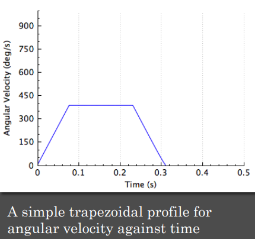
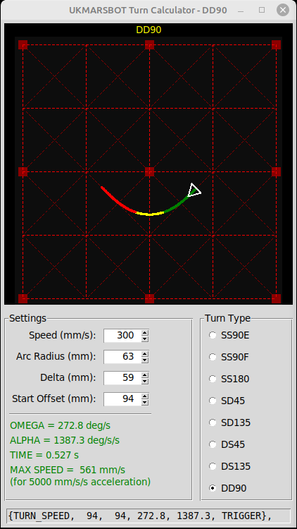

# UKMARSBOT Mazerunner Core Turn Tuner

All turns in the mazerunner-core software are performed by executing a simple trapezoidal angular velocity profile. 
In this repository you will find an explanation fo the turn behaviour, guidance on how to determine the key 
parameters and a neat graphical tool to let you visualise those turns



The resulting curve is technically a clothoid. It has three phases. 
- Phase 1 is where the robot transitions from straight to constant radius. During this phase, the angular velocity 
  increases linearly with time accordig to the angular acceleration. The magnitude of the angular acceleration is 
  determined by the speed of the robot, the length of delta and the radius set for phase 2. 
- Phase 2 is the constant radius section. Here the angular velocity is constant and the centripetal acceleration is 
  highest. 
- Phase 3 is where the robot unwinds to straight motion again. Like phase 1, the rate of change is set by the angular 
  acceleration. The turn is symmetrical so phase 3 happens over the same distance as phase 1.

In the diagram above, the path is shown with phases 1 and 2 in green and phase 2 in red.
 
You can choose the distance travelled during phase 1. In the code, this is referred to as the 'delta' for the turn. 

A longer phase 1 distance (bigger delta) produces a gentler transition and is easier on the wheels but may result in a 
larger 
lateral force than the robot can sustain without skidding. because the central, constant-radius phase must have a 
smaller radius to fit the turn in.

When choosing a value for delta, you must take care that it is not too long because the angle turned during phase 1 
and phase 2 cannot exceed the total angle for the turn. I will try and remember always to talk about the '__arc 
radius__' 
when I mean the radius during phase 2 and  the '__effective radius__' when I am referring to the start and end 
points of the curve.

Note that the existence of these entry and exit phases means that the effective radius of the curve is always greater than the actual radius of the middle phase.

## Parameters

If you were to analyse the turn, you would find that it can soon look quite complicated and there appear to be more 
variables than there are equations needed to get a closed solution. Thus, any given effective turn can be performed 
in a variety of ways. There is no universally 'correct' solution and choosing the best parameters for your robot is 
(a key) 
part of the development of better performance. It should be clear that you will want to be able to run any given 
turn at a variety of speeds. If you experiment enough, it is also clear that the variables in the equations depend 
upon the speed of the robot. That is, for a given turn, things like the angular acceleration and maximum angular 
velocity will be dependent upon speed. It will also soon become clear that you do'nt want to have to design from 
scratch each 
turn at all foreseeable speeds. 

If there is no 'correct' solution, you are forced to set some values to constrain the turn and make it possible to 
get a repeatable result. The method described here is very basic and designed to make it relatively easy to 
reproduce any turn at a variety of speeds. the resulting parameters should be reliable at any speed up to the point 
where ther effect of the wheels slipping becomes noticeable. As your turns get faster, then wheel slip will become 
an increasingly significant problem. For now though, I will pretty well ignore it.

So let's have a look at the parameters needed to define the turn:

- ### angle
This will be the total angle for the turn. In a micromouse maze, it will be one of 45, 90, 135 and 180 degrees. You 
may find that your mouse is not as accurate as you might hope or that the left and right turns are slightly 
different. These issues can be a result of mechanical limitations or software constraints like rounding errors or 
off-by-one loops. In these cases, you might find it necessary to apply small corrections such as making a left turn 
89.7 degrees and a right turn 90.1 degrees rather than the expected exact value.

- ### speed
You will want to run the turns as fast as you can but there is one uge constraint that will limit how fast you can 
go. That is the radius of the phase 2 arc. The limit is most likely due to slip caused by large centripetal forces. 
These forces are proportional to the _square_ of the speed and inversely proportional to the radius:

$$a = \frac{v^2}{r}$$

Thus doubling the speed will make the centripetal forces _four_ times as large. Anothe constraint will be the 
ability of the wheels to accelerate and brake. As the robot begins its turn, the outer wheel must accelerate and the 
inner wheel must brake. You will have a problem if the outer wheel cannot get any faster. You will also get a 
problem if either wheel loses traction because you are accelerating or braking too hard.

- ### radius
Remember that this is the radius of the arc that makes up phase 2 of the turn. It is _not_ the overall, effective 
radius of the turn. As shown above, reducing the radius will increase the risk that the robot will slip and 
overshoot the turn. There are two other riskd to consider. If the turn radius is less than the robot radius (half 
the distance between the wheels) then the inner wheel will have to stop and run backwards. The software, and the 
robot, can handle that but it is a sign that something is not right. The only time the inner wheel should not be 
moving forwards is in the case of one of the pivot turns. Another risk is that, if a turn is too tight, or started 
too early, the robot will clip a post. At best that is likely to knock the robot out of position in ways that are 
very difficult to correct. So don't do that. 

- ### delta 
As mentioned above, this is the distance over which the robot transitions from purely straight line motion to a 
constant radius arc. By specifying this parameter as a _distance_ rather than as a time,  you can keep that 
distance constant and calculate the time taken to cover that distance on the ground. This will vary by speed and it 
is one of the ways it is possible to run the turn at any (reasonable) speed. Larger values for delta ease the burden 
on the inner and outer wheels in this phase but will increase the forces in phase 2 because the arc radius will have 
to be smaller to compensate.

- ### offset
All the smooth turns in the mazerunner code can be used to replace one or more pivot turns. That is, a turn-in-place.
The position of the corresponding pivot-turn is one of the parameters of the turn. Or, more accurately, the 
parameter is how far before the pivot point the turn must begin. In the diagram above, you can see a small cross in 
a circle that is the pivot point for this turn. The distance from the start of the turn to the pivot point is the 
__offset__.

## Calculating The Trajectory

Now we have five parameters that can be used to completely describe the path of the robot during the turn. Coupled 
with the position of the pivot point, we have everything needed for the complete turn.

The mazerunner core code only needs four parameters to define the trajectory. You define two of these - the robot
__speed__ and the transition distance, __delta__

For the other two, there are simple calculations:

- __Angular Velocity__ (omega): We know the speed and the value of the arc radius. From those, we can calculate the 
  angular velocity during phase 2 since radius = speed/omega and so omega = speed/radius. The result is in radians so 
  these must be converted to degrees for greater readability.
- __Angular Acceleration__ (alpha). From the speed and the distance _delta_ , it is a simple matter to calculate the 
  time it will take to cover that distance since time = delta/speed. given the time and the desired angular 
  velocity, the angular acceleration is just alpha = omega/time = speed * time / omega

## Implementation

In the mazerunner code, there is a table of turn parameters that looks a bit like this:
```commandline
const TurnParameters turn_params[4] = {
    //           speed, runin, runout, angle, omega, alpha, sensor threshold
    {SEARCH_TURN_SPEED,    20,     10,    90,   287,  2866, TURN_THRESHOLD_SS90E}, // 0 => SS90EL
    {SEARCH_TURN_SPEED,    20,     10,   -90,   287,  2866, TURN_THRESHOLD_SS90E}, // 0 => SS90ER
    {SEARCH_TURN_SPEED,    20,     10,    90,   287,  2866, TURN_THRESHOLD_SS90E}, // 0 => SS90L
    {SEARCH_TURN_SPEED,    20,     10,   -90,   287,  2866, TURN_THRESHOLD_SS90E}, // 0 => SS90R
};
```
You should be able to match up the calculated values with the relevant entries in this table. The runin and runout 
values are the distance from the edge of a cell to the start of the turn and can be used to calculate the offset. 
Because mazerunner-core is very basic, there is an assumption that al turns take place within a cell so this is an 
appropriate way to collect the values. Note that, although the turns are symmetric in principle, the actual turns 
may well not be so the runin and runout values may be different. You will have to characterise those for your robot.

The only 'mysterious' parameter that seems to have nothing t do with the discussion above is the sensor threshold. 
In mazerunner-core, this is the sensor value that the robot would see if there were to be a wall ahead at the start 
of the turn. This value can be used to trigger the turn if the robot is not well positioned.

# Design
All this is well and good but how are you supposed to sit down with a robot, or a piece of paper and come up with 
suitable starting values for your robot? Don't worry. This repository contains a simple Python application that can 
help you visualise the turns and decide upon suitable parameters. You will need to have Python 3.x installed on your 
computer and set up in the path so that you can just run the command `python turn-tuner.py` in a command prompt. 
(You might need `python3 turn-tuner.py` on your computer.) The application should run with no other Python 
dependencies. If you want the icon image to show up. Make sure the turn-tuner.png file is in the same directory.
It should look like this:


The application should, I hope, need little explanation. You can select your turn type and mess with the four 
defining parameters as you see fit. Set crazy values and you will get crazy results. It will soon become more clear 
how the parameters interact to generate different trajectories.

As you change parameter values, you will see , in green, some output values. Most important of these are the OMEGA 
and ALPHA values that you will need to substitute in to the parameter table in mazerunner-core. You could select and 
copy out all or part of the example declaration at the bottom of the window.  

